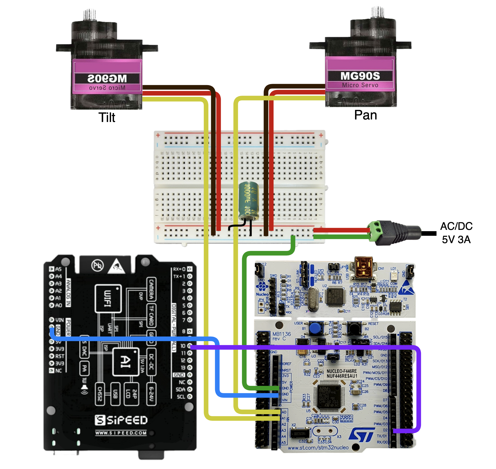

# maixduino-stm32-object-tracker
Embedded real-time object tracking with Maixduino, STM32 NUCLEO-F446RE, UART, and PWM servo control.

The system detects a red object using an OV2640 camera, calculates its position relative to the center of the frame, and automatically rotates the camera using two MG90S servo motors.

## Features

- Red object detection
- Real-time pan-tilt tracking
- UART communication between Maixduino and STM32
- PWM control of two MG90S servo motors
- Dead zone for stable positioning
- Maximum ±90° movement from the base position
- Smooth return to the base position
- LCD visualization with object bounding box

## Hardware

[Components List](hardware/components-list.md)

### Connection Diagram

## Firmware

To program the boards, I used MaixPy IDE for the Maixduino and STM32CubeIDE for the NUCLEO-F446RE.

### Maixduino handles:
- Camera input
- Red object detection
- Object center calculation
- Pan and tilt angle calculation
- UART transmission

[MaixPy Source Code](maixduino/main.py)

### STM32 NUCLEO-F446RE handles:
- UART reception
- Angle parsing
- PWM generation
- Pan and tilt servo control

[STM32 Source Code](stm32/main.c)

## Servo Control

- Pan servo: PA0 / TIM2_CH1
- Tilt servo: PA1 / TIM2_CH2
- PWM frequency: 50 Hz
- PWM period: 20 ms
- Servo angle range: 0–180°
- Base position: 90°
- Maximum offset: ±90°

## System Architecture

[System Architecture](system-architecture)

## 3D Parts

I also designed my own 3D pan-tilt mechanism in Fusion 360. Here are the STL files:

[3D Printable Parts](cad/3D-prints/)

## Documentation

[Project Presentation (PDF)](docs/project-presentation.pdf)

## Result

link video
